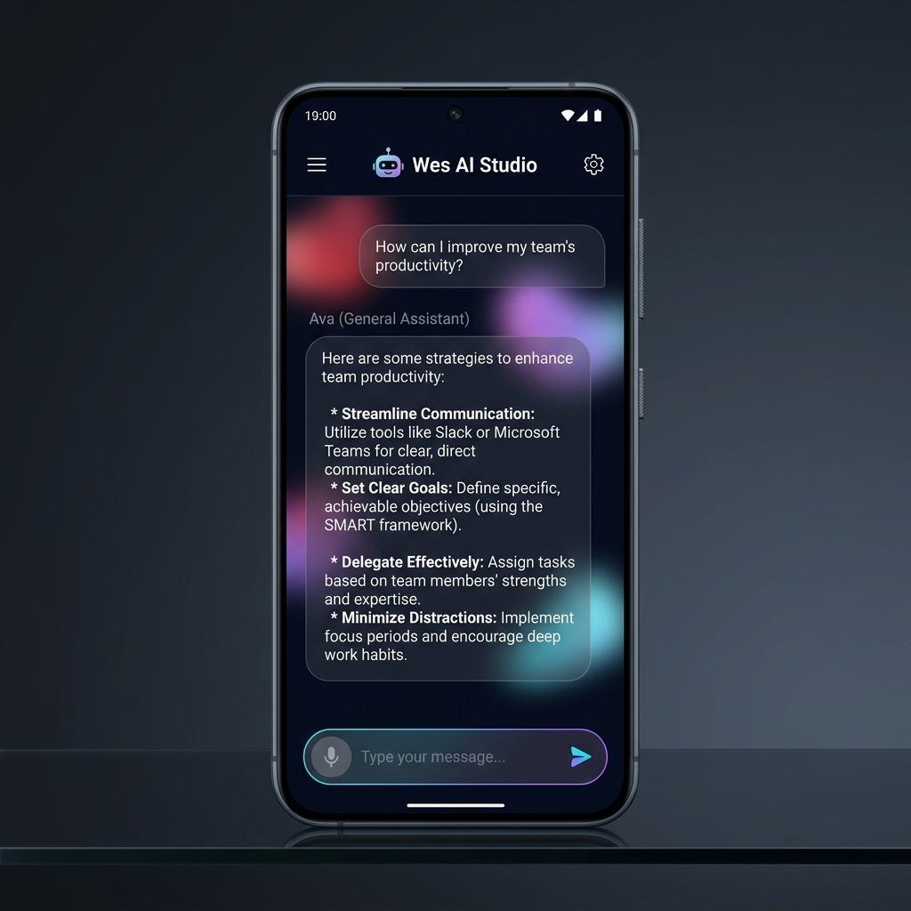
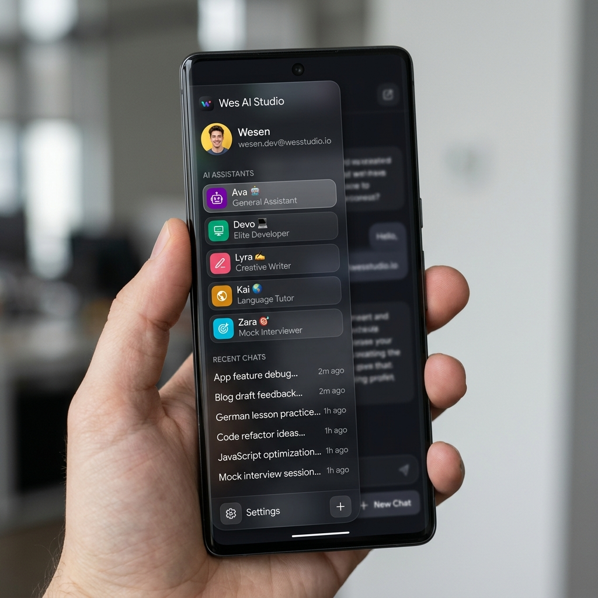
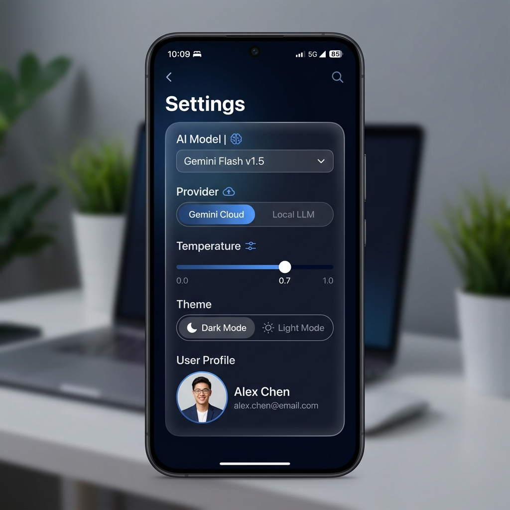

<h1 align="center">
  <br>
  
  <br>
  Wes AI Studio
  <br>
</h1>

<h4 align="center">A premium AI chat studio — available as a Web App & Native Android App</h4>

<p align="center">
  <a href="https://github.com/Wesen15/Wes-Ai-Studio/releases/latest">
    
  </a>
  
  
  
</p>

<p align="center">
  <a href="#-features">Features</a> •
  <a href="#-ai-assistants">AI Assistants</a> •
  <a href="#-download">Download</a> •
  <a href="#-getting-started">Getting Started</a> •
  <a href="#-tech-stack">Tech Stack</a>
</p>

---

## ✨ Features

| Feature | Description |
|--------|-------------|
| 🤖 **5 AI Personas** | Choose from specialized assistants — General, Developer, Writer, Tutor, and Interviewer |
| 🌐 **Multi-Provider** | Switch between **Gemini AI** (cloud) and **Local LLMs** (Ollama, LM Studio, Llama.cpp) |
| 📡 **Live Mode** | Real-time streaming AI responses |
| 🖼️ **Multimodal Input** | Attach and analyze images alongside your messages |
| 💬 **Chat Sessions** | Create, rename, delete, and switch between multiple conversation threads |
| 📤 **Export Chats** | Export any conversation as a Markdown file |
| 🌙 **Dark / Light Mode** | Full theme support with a polished dark mode |
| 📱 **Android Native App** | Runs as a real native Android app via WebView |
| 🔌 **Local LLM Scanner** | Built-in Wi-Fi scanner to auto-detect LLM servers on your local network |
| 💾 **Persistent History** | All sessions saved locally to device storage |

---

## 🧠 AI Assistants

Wes AI Studio comes with **5 specialized AI personas** built in:

| Avatar | Name | Role | Best For |
|--------|------|------|----------|
| 🤖 | **Ava** | General Assistant | Learning, explaining, everyday tasks |
| 💻 | **Devo** | Elite Developer | Code, architecture, debugging |
| ✍️ | **Lyra** | Creative Writer | Stories, copywriting, brainstorming |
| 🌍 | **Kai** | Language Tutor | Translation, grammar, language practice |
| 🎯 | **Zara** | Mock Interviewer | Interview prep, feedback, system design |

---

## 📲 Download

> **Download the latest Android APK directly:**

👉 **[`releases/weschat-debug.apk`](releases/weschat-debug.apk)**

> ⚠️ **Note:** This is a debug build. On Android, go to **Settings → Security → Install Unknown Apps** and allow installation from your file manager.

---

## 🚀 Getting Started

### Prerequisites
- [Node.js](https://nodejs.org/) v18+
- A [Google Gemini API Key](https://aistudio.google.com/app/apikey)

### 1. Clone the repo
```bash
git clone https://github.com/Wesen15/Wes-Ai-Studio.git
cd Wes-Ai-Studio
```

### 2. Install dependencies
```bash
npm install
```

### 3. Set up your API key
```bash
cp .env.example .env
```
Open `.env` and add your Gemini API key:
```env
VITE_GEMINI_API_KEY=your_api_key_here
```

### 4. Run the dev server
```bash
npm run dev
```

Open your browser at `http://localhost:5173` 🎉

---

## 🔌 Local LLM Support

Wes AI Studio supports running **completely offline** with a local AI model.

Supported providers:
- **[Ollama](https://ollama.com/)** — `http://localhost:11434`
- **[LM Studio](https://lmstudio.ai/)** — `http://localhost:1234`
- **[Llama.cpp](https://github.com/ggerganov/llama.cpp)** — Custom server URL

In the app, go to **Settings → Provider → Local LLM** and enter your server URL and model name.

> 💡 Use the built-in **Wi-Fi Scanner** to auto-detect LLM servers running anywhere on your local network!

---

## 🏗️ Tech Stack

| Layer | Technology |
|-------|-----------|
| **Framework** | React 19 + TypeScript |
| **Build Tool** | Vite 6 |
| **Styling** | Tailwind CSS v4 |
| **AI SDK** | `@google/genai` (Gemini) |
| **Animations** | Motion (Framer Motion) |
| **Icons** | Lucide React |
| **Android** | Android WebView (Capacitor-style) |

---

## 📁 Project Structure

```
Wes-Ai-Studio/
├── src/
│   ├── components/        # UI Components (Sidebar, ChatArea, etc.)
│   ├── lib/               # Live mode client
│   ├── assets/            # Logos and images
│   ├── App.tsx            # Root application
│   ├── constants.ts       # AI assistant definitions
│   ├── geminiClient.ts    # Multi-provider AI dispatcher
│   └── types.ts           # TypeScript types
├── android/               # Android native project
├── scripts/               # Build & asset scripts
├── releases/              # Prebuilt APK downloads
└── public/                # Static assets
```

---

## 📸 Screenshots

<p align="center">
  
  &nbsp;&nbsp;
  
  &nbsp;&nbsp;
  
</p>

<p align="center">
  <em>Chat Screen &nbsp;&nbsp;&nbsp;&nbsp;&nbsp;&nbsp;&nbsp;&nbsp;&nbsp;&nbsp;&nbsp;&nbsp; AI Assistants Sidebar &nbsp;&nbsp;&nbsp;&nbsp;&nbsp;&nbsp;&nbsp;&nbsp;&nbsp;&nbsp;&nbsp;&nbsp; Settings Screen</em>
</p>

---

## 📄 License

This project is open source. Feel free to fork, modify, and share.

---

<p align="center">
  Made with ❤️ by <a href="https://github.com/Wesen15">Wesen15</a>
</p>
